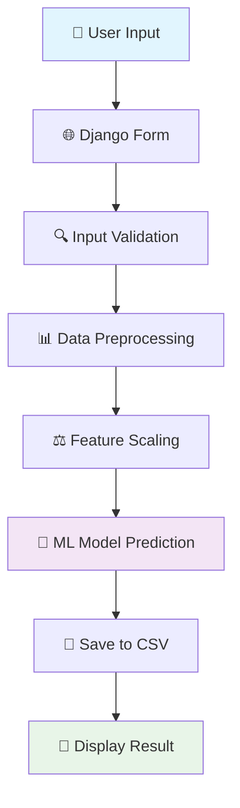

# 🩺 Diabetes Predictor

<div align="center">


*A machine learning-powered web application for diabetes risk prediction*

</div>

## 📋 Table of Contents

- [Overview](#-overview)
- [Features](#-features)
- [Technology Stack](#-technology-stack)
- [Project Workflow](#-project-workflow)
- [Installation](#-installation)
- [Usage](#-usage)
- [Model Information](#-model-information)
- [API Endpoints](#-api-endpoints)
- [Project Structure](#-project-structure)
- [Contributing](#-contributing)
- [License](#-license)

## 🎯 Overview

The Diabetes Predictor is a web-based application that uses machine learning to assess diabetes risk based on medical parameters. Built with Django and powered by a trained ML model, it provides instant predictions through an intuitive web interface.

## ✨ Features

- 🔮 **Real-time Prediction**: Instant diabetes risk assessment
- 📊 **ML-Powered**: Uses trained machine learning model with scaler normalization
- 💾 **Data Storage**: Automatically saves predictions to CSV for analysis
- 🎨 **User-Friendly Interface**: Clean, responsive web design
- 🔒 **Input Validation**: Ensures data integrity and error handling
- 📈 **Historical Data**: Tracks all predictions for future analysis

## 🛠 Technology Stack

| Component | Technology |
|-----------|------------|
| **Backend** | Django 4.0+ |
| **Frontend** | HTML5, CSS3 |
| **ML Framework** | Scikit-Learn |
| **Data Processing** | NumPy, Pandas |
| **Model Serialization** | Joblib |
| **Database** | SQLite |

## 🔄 Project Workflow



### 🎬 Application Flow Animation

```
🏠 Home Page
    ↓
📝 User fills medical data form
    ↓
🔄 Form submission (POST request)
    ↓
⚡ Backend processing:
   • Load trained model & scaler
   • Normalize input data
   • Generate prediction
   • Save to submissions.csv
    ↓
📊 Result display:
   • ✅ No Diabetes (Green)
   • ⚠️ Diabetes Risk (Red)
```

## 🚀 Installation

### Prerequisites

- Python 3.8+
- pip package manager

### Step-by-Step Setup

1. **Clone the repository**
   ```bash
   git clone https://github.com/yourusername/Diabetes-Predictor.git
   cd Diabetes-Predictor
   ```

2. **Create virtual environment**
   ```bash
   python -m venv diabetes_env
   
   # Windows
   diabetes_env\Scripts\activate
   
   # macOS/Linux
   source diabetes_env/bin/activate
   ```

3. **Install dependencies**
   ```bash
   pip install django numpy scikit-learn joblib pandas
   ```

4. **Run migrations**
   ```bash
   python manage.py migrate
   ```

5. **Start the development server**
   ```bash
   python manage.py runserver
   ```

6. **Access the application**
   ```
   Open your browser and navigate to: http://127.0.0.1:8000/
   ```

## 💻 Usage

### Input Parameters

The application requires 8 medical parameters:

| Parameter | Description | Range |
|-----------|-------------|-------|
| **Pregnancies** | Number of pregnancies | 0-20 |
| **Glucose** | Plasma glucose concentration | 0-200 mg/dL |
| **Blood Pressure** | Diastolic blood pressure | 0-140 mmHg |
| **Skin Thickness** | Triceps skin fold thickness | 0-100 mm |
| **Insulin** | 2-Hour serum insulin | 0-900 mu U/ml |
| **BMI** | Body mass index | 0-70 kg/m² |
| **Diabetes Pedigree Function** | Genetic predisposition | 0.0-2.5 |
| **Age** | Age in years | 21-100 |

### Example Usage

1. Navigate to the home page
2. Fill in all 8 medical parameters
3. Click "Predict" button
4. View the prediction result:
   - ✅ **Green**: No diabetes risk detected
   - ⚠️ **Red**: Diabetes risk detected - consult a doctor

## 🧠 Model Information

- **Algorithm**: Machine Learning Classification Model
- **Features**: 8 medical parameters
- **Preprocessing**: StandardScaler normalization
- **Output**: Binary classification (0: No Diabetes, 1: Diabetes)
- **Model Files**:
  - `model.pkl`: Trained ML model
  - `scaler.pkl`: Feature scaler for normalization

## 🌐 API Endpoints

| Endpoint | Method | Description |
|----------|--------|-------------|
| `/` | GET | Home page with prediction form |
| `/add/` | POST | Process prediction request |

## 📁 Project Structure

```
Diabetes-Predictor/
├── 📁 Addition_dj/           # Django project settings
│   ├── __init__.py
│   ├── settings.py           # Project configuration
│   ├── urls.py              # URL routing
│   └── wsgi.py              # WSGI configuration
├── 📁 myapp/                # Main application
│   ├── 📁 migrations/       # Database migrations
│   ├── 📁 templates/        # HTML templates
│   │   └── add.html         # Main prediction form
│   ├── admin.py             # Admin configuration
│   ├── views.py             # Application logic
│   ├── urls.py              # App URL patterns
│   ├── model.pkl            # 🤖 Trained ML model
│   ├── scaler.pkl           # ⚖️ Feature scaler
│   ├── diabetes.csv         # 📊 Training dataset
│   └── submissions.csv      # 💾 Prediction history
├── manage.py                # Django management script
├── db.sqlite3              # 🗄️ SQLite database
└── README.md               # 📖 Project documentation
```

## 🔧 Configuration

### Django Settings

Key configuration in `Addition_dj/settings.py`:

- **DEBUG**: Set to `False` for production
- **ALLOWED_HOSTS**: Configure for deployment
- **DATABASES**: SQLite by default

### Model Configuration

- Models are loaded using `joblib.load()`
- Automatic CSV logging for all predictions
- Error handling for invalid inputs

## 🤝 Contributing

1. Fork the repository
2. Create a feature branch (`git checkout -b feature/AmazingFeature`)
3. Commit your changes (`git commit -m 'Add some AmazingFeature'`)
4. Push to the branch (`git push origin feature/AmazingFeature`)
5. Open a Pull Request

## 📊 Future Enhancements

- [ ] Add user authentication system
- [ ] Implement prediction confidence scores
- [ ] Create data visualization dashboard
- [ ] Add model retraining capabilities
- [ ] Implement REST API endpoints
- [ ] Add mobile-responsive design
- [ ] Include prediction history for users

## 🐛 Troubleshooting

### Common Issues

1. **Model not found error**
   - Ensure `model.pkl` and `scaler.pkl` are in the `myapp/` directory

2. **CSV permission error**
   - Check write permissions for the project directory

3. **Import errors**
   - Verify all dependencies are installed: `pip install -r requirements.txt`

## 📄 License

This project is licensed under the MIT License - see the [LICENSE](LICENSE) file for details.

## 👨‍💻 Author

**Your Name**
- GitHub: [@yourusername](https://github.com/yourusername)
- Email: your.email@example.com

## 🙏 Acknowledgments

- Dataset source: [Pima Indians Diabetes Database](https://www.kaggle.com/datasets/uciml/pima-indians-diabetes-database)
- Django framework for web development
- Scikit-learn for machine learning capabilities

---

<div align="center">

**⭐ Star this repository if you found it helpful!**

Made with ❤️ and 🤖 Machine Learning

</div>